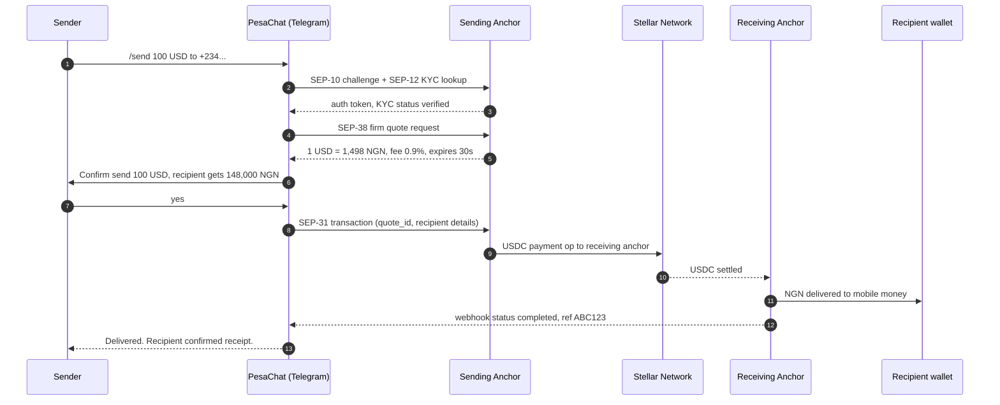

## The problem we are solving

According to the World Bank, the average cost of sending $200 to Sub-Saharan Africa is 7.9% — the highest in the world. For a Nigerian nurse in Manchester sending £200 home every month, that is roughly £190 a year lost to fees. For a family receiving $100 from a relative in Houston, that is $8 that never makes it to the dinner table.

The reasons are familiar:

- **Two-rail fees**: the sending corridor charges, the receiving corridor charges, and FX spreads on both sides eat the rest.
- **Slow settlement**: most corridors still take one to three business days. Money does not move on Sundays.
- **Bad UX**: app downloads, branch visits, photo-IDs, MTCN codes. None of this fits how the diaspora actually communicates with home.

We built PesaChat because the diaspora already lives in chat. WhatsApp, Telegram, Signal — these are where families talk. Money should move on the same rails.

## What PesaChat does

PesaChat is a Telegram bot that lets a sender start a remittance with a single message:

```
/send 100 USD to +2348012345678
```

The bot handles authentication, KYC, quoting, FX, settlement, and delivery confirmation. USDC moves over the Stellar network between regulated anchors using SEP-31. The recipient receives local currency in their mobile-money wallet or bank account — typically within minutes, often within seconds.

WhatsApp support is on the roadmap (the bot abstraction is platform-agnostic), but Telegram is our day-one rail because it ships without Meta Business approval delays.

## How a transfer flows



The whole flow takes 10–60 seconds end-to-end, depending on the receiving anchor's last-mile delivery method.

## Supported corridors

| Send from | Send to | Sending anchor | Receiving anchor | Last-mile | Status |
|---|---|---|---|---|---|
| US | Nigeria | Vibrant | Cowrie | Bank, USSD | Live |
| UK | Nigeria | Vibrant | Cowrie | Bank, USSD | Live |
| US | Kenya | Vibrant | Pendo | M-Pesa | Live |
| UK | Kenya | Vibrant | Pendo | M-Pesa | Live |
| Canada | Ghana | Saldo | ClickPesa | Mobile money | Beta |
| US | Tanzania | Vibrant | ClickPesa | M-Pesa, Tigo | Beta |
| EU | South Africa | Saldo | (in review) | Bank | Coming |
| Australia | Zimbabwe | (in review) | (in review) | EcoCash | Coming |

We add corridors as anchor partnerships clear compliance. If a corridor matters to you, open an issue or write to corridors@pesachat.dev.

## Architecture

### Bot layer

The Telegram interface is a `python-telegram-bot` long-poll worker (transitioning to webhook for production). Conversation state lives in Redis — each user has a session that survives restarts. The bot speaks English, French, Swahili, and Yoruba; locale auto-detects from the Telegram client and is overridable with `/lang`.

### Anchor integration layer

A FastAPI service (`pesachat-core`) owns all anchor communication. It implements SEP-10, SEP-12, SEP-31, and SEP-38 as composable client modules. Adding a new anchor is a config entry plus credential pair — the SEP clients are corridor-agnostic.

### Settlement layer

A small Stellar SDK service watches for incoming webhooks from receiving anchors and reconciles them against pending transactions in PostgreSQL. Failed settlements trigger refund flows automatically.

```
telegram  <->  pesachat-bot  <->  pesachat-core  <->  sending anchor
                                        |
                                        v
                                    Stellar
                                        |
                                        v
                              receiving anchor  <->  recipient
```

## SEPs we implement

### SEP-10 (Stellar Web Auth)
We use SEP-10 to authenticate the sender's wallet to each anchor on first use. The bot generates a Stellar keypair per user on signup; the public key is the user's identity. Private keys are encrypted at rest with envelope encryption (KMS).

### SEP-12 (KYC API)
KYC tiers map to corridor and amount limits. Tier 0 (no KYC) is wallet-creation only; Tier 1 (basic KYC) covers most corridors up to $1,000/month; Tier 2 (full KYC with ID and proof of address) unlocks higher limits. KYC documents are uploaded directly to the anchor — PesaChat does not store identity documents.

### SEP-31 (Cross-border payments API)
SEP-31 is the centerpiece. It is a direct anchor-to-anchor protocol designed exactly for this use case: a regulated sending anchor accepts fiat and instructs a regulated receiving anchor to deliver fiat to a beneficiary. PesaChat is a SEP-31 sending client.

### SEP-38 (Quotes)
Every transfer starts with a firm quote good for 30 seconds. The quote locks FX and fees so the sender confirms exactly what the recipient will receive. If the quote expires, we re-quote silently before submission.

We do not use SEP-24 — that protocol assumes the user is on a web frontend with an interactive iframe, which does not fit a chat UI. SEP-31 is the right primitive for chat-driven remittance.

## Running PesaChat locally

Requirements: Python 3.11+, Redis, PostgreSQL, a Telegram bot token, and credentials for at least one Stellar testnet anchor.

```bash
git clone https://github.com/tosirano/pesachat.git
cd pesachat
poetry install
cp .env.example .env   # fill in TELEGRAM_TOKEN, ANCHOR_*, DB_URL, REDIS_URL
poetry run alembic upgrade head
poetry run pesachat-bot      # in one terminal
poetry run pesachat-core     # in another
```

Talk to your bot on Telegram: `/start`, then `/send 10 USD to +234...` against the testnet anchor.

## Deployment

We run PesaChat on a small Kubernetes cluster: two replicas of the bot worker, two of the core API, one Redis, one PostgreSQL primary with read replica. Helm charts live in `deploy/helm/`. Cloudflare Tunnel fronts the Telegram webhook in production so we do not expose the bot directly.

Anchor webhooks (settlement confirmations) hit the core API on a separate path, signed with HMAC. Replay protection uses a Redis nonce store with 24h TTL.

## Compliance and KYC

PesaChat itself is not a money service business. We are a software interface to regulated Stellar anchors who hold MSB licenses in their respective jurisdictions. The compliance burden — KYC, AML, sanctions screening, reporting — sits with the anchors.

What this means in practice:

- We do not custody fiat or crypto. Sender funds move from the sender's bank to the sending anchor; the recipient's funds come from the receiving anchor.
- We do not store ID documents. KYC uploads go directly to the anchor via SEP-12.
- We do enforce the corridor limits the anchor sets and we surface KYC status to the user inside the chat.

If you fork PesaChat to operate in a new jurisdiction, you are responsible for your own anchor relationships and compliance posture.
